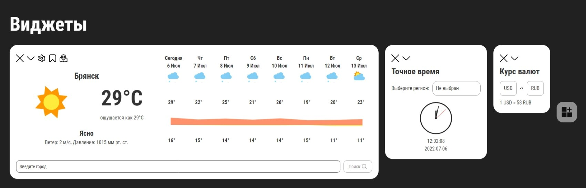

<h1 align="center">Widgets</h1>

## Description

Web app for adding, using and removing widgets.

Current list of widgets:

- :sunny: *Weather Forecast*,
- :dollar: *Exchange Rate*,
- :watch: *Exact Time*.



<br>

[Link to the site is here.](https://reliable-raindrop-761a7a.netlify.app/)

___

<br>

## Weather Forecast

```
Soon...
```

<br>

___

<br>

## Exchange Rate

This widget uses [CBR xml requests](https://www.cbr.ru/development/sxml/),
and it doesn't need any api key.

<br>

Function that loads currencies data.

```
async loadExchangeRate() {
  this.showLoading();

  await this.$http
    .get(`${this.baseURL}scripts/XML_daily.asp`)
    .then(response => {
      const json = this.xmlToJson(response.data);

      this.currencies = this.formatCurrencies(json);
    })
    .catch(this.handleRequestErrors)
    .finally(this.hideLoading);
}
```

<br>

___

<br>

## Exact Time

This widget uses [WorldTimeApi](https://worldtimeapi.org/),
and it doesn't need any api key.

<br>

Function that loads time data by timezone.

```javascript
async loadTimeByTimezone(timezone) {
    this.showLoading();

    await this.$http
    .get(`${this.baseURL}timezone/${timezone}`)
    .then(response => {
        this.resetError();

        const time = response.data.datetime;

        this.setTime(this.getFormattedTime(time));
    })
    .catch(this.handleRequestErrors)
    .finally(this.hideLoading);
}
```

<br>

Function that loads time data by ip.
This function is called every time you add the widget.

```javascript
async loadTimeByIp() {
  this.showLoading();

  await this.$http
    .get(`${this.baseURL}ip`)
    .then(response => {
      this.resetError();

      const time = response.data.datetime;

      this.startClocks(this.getFormattedTime(time));
    })
    .catch(this.handleRequestErrors)
    .finally(this.hideLoading);
}
```

<br>

___

<br>

## Project setup

```shell
npm install
```

Also, you need to get your own api key from [OpenWeatherMap](https://openweathermap.org/)
and put it inside .env and .env.production files on the root of the project (Example shown in .env.example).

### Compiles and hot-reloads for development

```shell
npm run serve
```

### Compiles and minifies for production

```shell
npm run build
```